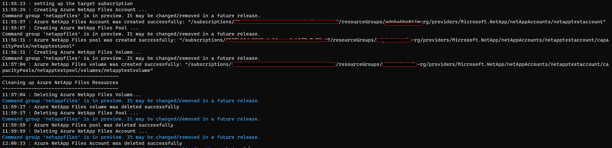

# Azure NetAppFiles SDK NFSv3/NFS4.1 Sample CLI

This project demonstrates how to deploy NFSv3/NFSv4.1 protocol type volume using CLI and Azure NetApp Files SDK.

In this sample application we perform the following operations:

* Creation
  * ANF Account
  *	Capacity pool 
  * Primary NFS v4.1 Volume 
 
* Deletion, the clean up process takes place (not enabled by default, please set the parameter SHOULD_CLEANUP to true if you want the clean up code to take a place),deleting all resources in the reverse order following the hierarchy otherwise we can't remove resources that have nested resources still live.


If you don't already have a Microsoft Azure subscription, you can get a FREE trial account [here](http://go.microsoft.com/fwlink/?LinkId=330212).

## Prerequisites

1. Azure Subscription
1. Subscription needs to be enabled for Azure NetApp Files. For more information, please refer to [this](https://docs.microsoft.com/azure/azure-netapp-files/azure-netapp-files-register#waitlist) document.
1. Resource Group created
1. Virtual Network with a delegated subnet to Microsoft.Netapp/volumes resource. For more information, please refer to [Guidelines for Azure NetApp Files network planning](https://docs.microsoft.com/en-us/azure/azure-netapp-files/azure-netapp-files-network-topologies)
1. Windows or Ubuntu terminal to run the script.
1. Make sure you have jq command-line tool installed by using a package manager like apt and install it with a single command, please refer to [this](https://devdojo.com/bobbyiliev/how-to-work-with-json-in-bash-using-jq#installation)
	
	
# How the project is structured

The following table describes all files within this solution:

| Folder     | FileName                | Description                                                                                                                         |
|------------|-------------------------|-------------------------------------------------------------------------------------------------------------------------------------|
| src        | CreateANFVolume.sh      | Authenticates and executes all operations                                                                                           |

# How to run the CLI script

1. Clone it locally
    ```powershell
    git clone https://github.com/Azure-Samples/netappfiles-cli-nfs-sdk-sample.git
    ```
	
1. Open the terminal and execute the following Run the script

	 * Change folder to **netappfiles-cli-nfs-sdk-sample\src\**
	 * Open CreateANFVolume.sh and edit all the parameters
	 * Save and close
	 * Run the following command
	 ``` Terminal
	 ./CreateANFVolume.sh
	 ```

	Sample output
	

	
# References

* [Azure NetApp Files Az commands](https://docs.microsoft.com/en-us/cli/azure/netappfiles?view=azure-cli-latest)
* [Resource limits for Azure NetApp Files](https://docs.microsoft.com/en-us/azure/azure-netapp-files/azure-netapp-files-resource-limits)
* [Azure Cloud Shell](https://docs.microsoft.com/en-us/azure/cloud-shell/quickstart)
* [Download Azure SDKs](https://azure.microsoft.com/downloads/)